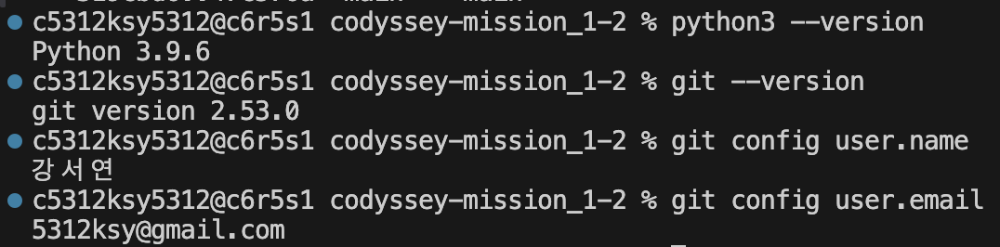
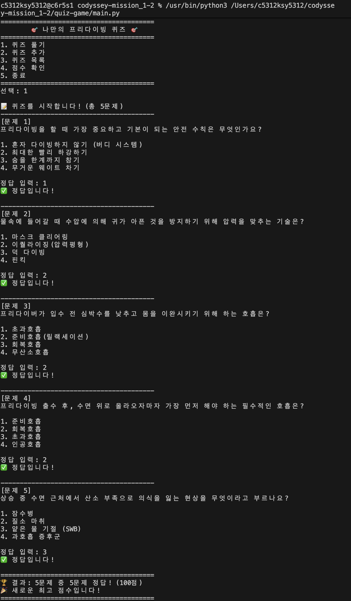
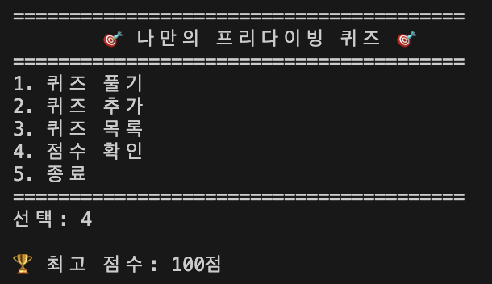

# codyssey-mission_1-2

# 🎯 나만의 프리다이빙 퀴즈 게임

## 1. 프로젝트 개요
터미널에서 실행되는 파이썬 기반의 객체 지향 퀴즈 프로그램입니다. 파이썬의 클래스 구조와 JSON 파일 입출력을 활용하여 데이터 영속성이 보장되는 CLI 게임을 구현했습니다.

## 2. 퀴즈 주제 선정 이유
**주제: 프리다이빙 기초 이론 및 안전 수칙**
최근 프리다이빙에 관심에 생겨 기초 강습을 받고 라이센스를 딴뒤 이번 여름에 바다에 나가서 실제로 해볼예정이라 실습전 이론 점검차 퀴즈 주제로 선정하게 되었습니다.

## 3. 실행 방법
파이썬 3.10 이상의 환경(작업 환경상 3.9 호환)에서 아래 명령어를 터미널에 입력하여 실행합니다.
```bash
python quiz-game/main.py
```

## 4. 기능 목록
- **퀴즈 풀기**: 저장된 퀴즈를 풀고 정답 여부와 최종 점수를 확인합니다.
- **퀴즈 추가**: 프로그램 내에서 새로운 문제를 직접 작성하고 등록할 수 있습니다.
- **퀴즈 목록**: 현재 등록된 모든 퀴즈의 문제 내용과 개수를 확인합니다.
- **점수 확인**: 게임에서 획득한 역대 최고 점수를 확인합니다.

## 5. 파일 구조
codyssey-mission_1-2/
├── quiz-game/
│   └── main.py       # 퀴즈 게임의 핵심 로직 (Quiz, QuizGame 클래스)
├── state.json        # 퀴즈 데이터 및 최고 점수가 영구 저장되는 데이터 파일
├── .gitignore        # Git 관리에서 제외할 파일 목록
└── README.md         # 프로젝트 설명 문서

## 6. 데이터 파일 설명 (state.json)
- **경로**: 프로젝트의 루트 또는 `quiz-game` 디렉토리 내에 위치합니다.
- **역할**: 프로그램이 종료되어도 퀴즈 목록과 최고 점수가 유지되도록 데이터를 영구적으로 보존합니다.
- **스키마(구조)**: UTF-8 인코딩을 사용하며 아래와 같은 형태를 가집니다.
```json
{
    "quizzes": [
        {
            "question": "프리다이빙을 할 때 가장 중요하고 기본이 되는 안전 수칙은 무엇인가요?",
            "choices": ["버디 시스템 유지", "빠른 하강", "숨 오래 참기", "무거운 웨이트 착용"],
            "answer": 1
        }
    ],
    "best_score": 5
}
```

## 7. 실행 스크린샷

### 7-1. 개발 환경 설정


### 7-2. 프로그램 실행 결과

**플레이**



**점수 확인**



**퀴즈추가**


### 7-3. git log --oneline --graph 결과
<!-- 아래에 git log 실행 스크린샷을 첨부하세요 -->


### 7-4. Git clone / pull 실습
<!-- 아래에 clone과 pull 명령어를 실행한 스크린샷을 첨부하세요 -->

